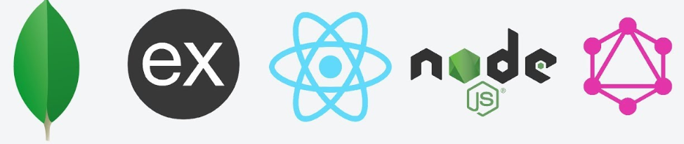

# TODO web application

## Front-End
* React
* Material UI
* Apollo GraphQL

## Back-end
* MongoDB
* Apollo GraphQL
* Node.js
* Express.js

⚠️ Just reading from mongoDB is working currently. another CRUD operations are under construction
